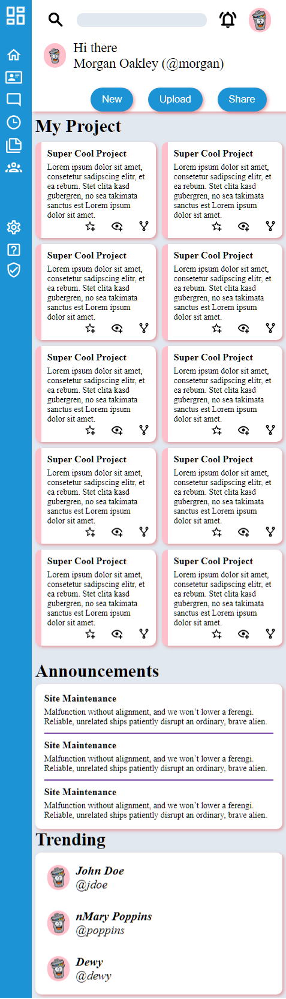

# Project: Admin Dashboard (Frontend) - The Odin Project

## Project Overview
Welcome to the Admin Dashboard project. This project is part of "The Odin Project" curriculum, Intermediate HTML and CSS Course, focusing on creating a responsive and visually appealing admin dashboard using HTML and CSS. The emphasis is on mastering responsive design techniques, CSS Grid, and Flexbox, along with exploring some additional concepts to enhance the user experience.

## Technologies Used
* **HTML:** For structuring the web pages.
* **CSS:** For styling the web pages.
* **Media** Queries: Adjusted layouts and styles for different screen sizes, ensuring responsiveness.
* **Custom Properties (CSS Variables):** Used for consistent styling across the dashboard.

## Features
* **Responsive Design:** Ensures the dashboard looks great on all devices, from desktops to smartphones.
* **CSS Grid and Flexbox: Utilizes modern CSS techniques for layout and alignment.
* **Nested Grids and Flex Containers: Demonstrates advanced CSS layout strategies for complex designs.
* **Interactive Elements: Highlights include hover effects and active states for buttons and links, enhancing user interaction.

### Project Specification
[Project: Admin Dashboard)](https://www.theodinproject.com/lessons/node-path-intermediate-html-and-css-admin-dashboard)

## Screenshots
  

